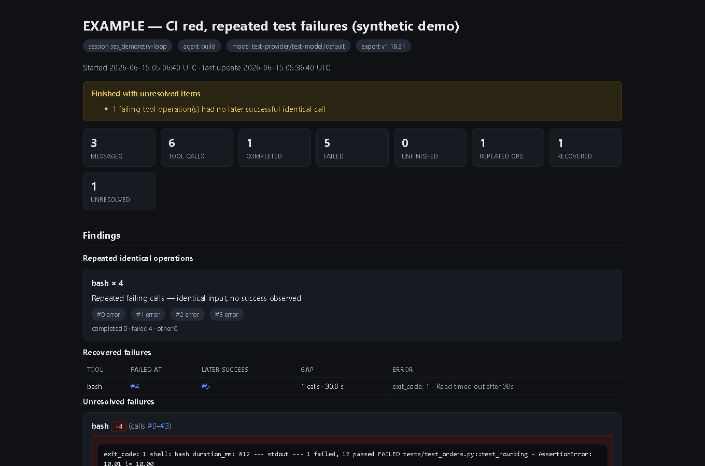

# Agent Run Inspector — documentation & sample reports

Agent Run Inspector turns an `opencode export` session file into a single
self-contained HTML report: repeated tool calls (classified), recovered vs
unresolved failures, completion state, tool statistics, attached files,
applied patches and context-compaction markers, plus provider-reported
usage. It runs locally, uses only the Python standard library, makes no
network requests, and never modifies its input.



This repository is the **public documentation and sample pack**. The software
itself is a finished commercial product (one-time purchase):

- **Free sample pack** (the files in `samples/`): https://payhip.com/b/I6OnS
- **Individual licence — USD $49**: https://payhip.com/b/iF1Av
- **Team licence — USD $149** (one organization, up to five named users):
  https://payhip.com/b/w10Iu
- Store: https://payhip.com/Superkamoubot
- Walkthrough (Payhip blog): https://payhip.com/Superkamoubot/blog/superkamoubot/how-to-inspect-repeated-opencode-tool-calls-from-a-session-export

## Live examples (GitHub Pages)

Open any synthetic sample report straight in a browser — no download needed:

- [Retry loop](https://kaboumou.github.io/agent-run-inspector-docs/samples/example-retry-loop-report.html)
- [Normal session](https://kaboumou.github.io/agent-run-inspector-docs/samples/example-normal-report.html)
- [Provider error](https://kaboumou.github.io/agent-run-inspector-docs/samples/example-provider-error-report.html)
- [Interrupted session](https://kaboumou.github.io/agent-run-inspector-docs/samples/example-interrupted-report.html)

Landing page: https://kaboumou.github.io/agent-run-inspector-docs/

## What is in here

- `samples/` — four **synthetic** example sessions and the reports Agent Run
  Inspector generates from them, including a repeated-failure loop and a
  recovered-failure case. Everything is fabricated for demonstration; no real
  user data. Each sample comes as the input JSON plus the generated HTML and
  JSON reports.
- `docs/how-to-read-the-report.md` — the exact workflow and how to interpret
  every finding.
- `screenshots/` — report screenshots used in the store listings and the
  walkthrough.

## Quickstart (with the purchased build)

```
opencode export ses_abc123 > session.json
runinspector session.json
```

Requirements: Python 3.9+ (standard library only). Tested by the seller on
Windows 11 with Python 3.11; the code itself is OS-independent. Input format:
`opencode export` JSON, tested against OpenCode 1.18.x (other versions run
best-effort with an explicit warning in the report).

## What it does not do

- It **detects and reports**; it does not fix, prevent, or monitor anything.
- It analyzes **one export at a time**.
- Token and cost figures are **as reported by OpenCode**, not an invoice.
- It does not determine whether a whole coding task was correct.
- Claude Code JSONL is not supported (other tools cover that).

## Privacy

Transcript content is HTML-escaped in the report, so nothing from an export
can execute, and the program makes no network requests. Reports still contain
your session content — **review before sharing** with anyone.

## Licence

- Documentation and synthetic samples in this repository: CC BY 4.0 — see
  `LICENSE`.
- The Agent Run Inspector software is a separate commercial product and is
  not covered by that licence.

## Contact

For documentation questions, open an issue here (please include no secrets or
customer data). For purchase or delivery issues, use the store contact at
https://payhip.com/Superkamoubot.
